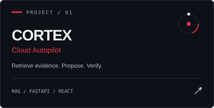
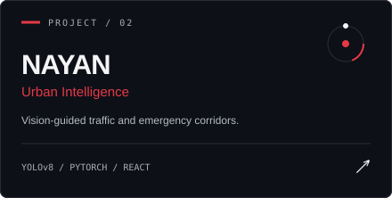
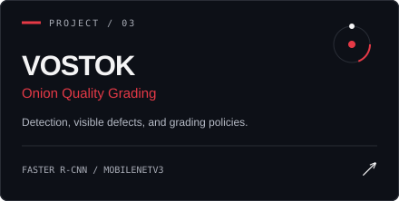
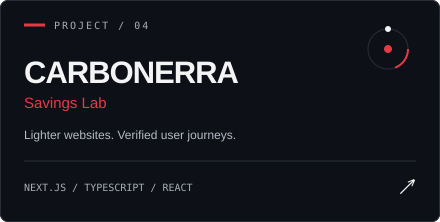

<div align="center">




<a href="https://www.linkedin.com/in/ganesh-nair-8ab1a5378/"></a>
<a href="https://github.com/GaneshNair007?tab=repositories"></a>

<br/><br/>

**AI Engineer in Training · B.Tech AI & ML, SIT Pune · India**

I build the software around intelligence: **retrieval pipelines, computer vision,**<br/>
**incident-response tools, and the interfaces that make them usable.**

</div>

### 01 — SELECTED BUILDS

<table>
<tr>
<td width="50%"><a href="https://github.com/GaneshNair007/CORTEX-CLOUD-AUTOPILOT-"></a></td>
<td width="50%"><a href="https://github.com/GaneshNair007/nayan-"></a></td>
</tr>
<tr>
<td width="50%"><a href="https://github.com/GaneshNair007/Onion-grading-deeplearning-SIH-"></a></td>
<td width="50%"><a href="https://github.com/GaneshNair007/PCCOE-HACKATHON"></a></td>
</tr>
</table>

<details>
<summary><b>Behind the builds — architecture & scope</b></summary>

- **[CORTEX](https://github.com/GaneshNair007/CORTEX-CLOUD-AUTOPILOT-):** semantic + lexical incident retrieval, AI proposals, deterministic policies, approval controls, and post-action verification. Current execution scope is a local service sandbox.
- **[NAYAN](https://github.com/GaneshNair007/nayan-):** YOLOv8 detection, ByteTrack tracking, road-space analysis, and an operator console. Emergency-corridor actions require human authorization.
- **[VOSTOK](https://github.com/GaneshNair007/Onion-grading-deeplearning-SIH-):** Faster R-CNN detection, MobileNetV3 attributes, calibrated measurements, and versioned grading rules. Acoustic screening is a synthetic-data research demo.
- **[Carbonerra](https://github.com/GaneshNair007/PCCOE-HACKATHON):** measures transfer waste and verifies that optimizations preserve user tasks, with release budgets to catch regressions.

</details>

### 02 — MY TOOLKIT

<div align="center">


**RAG · ChromaDB · Sentence Embeddings · Pandas · NumPy · Streamlit**

</div>

### 03 — INSIDE MY WORKSPACE

```python
class GaneshNair:
    focus = ["AI agents", "computer vision", "retrieval systems"]
    learning = ["model evaluation", "AI system design"]
    approach = "Build it. Measure it. Understand the trade-offs."
    next = "AI engineering -> AI systems architecture"
```

### 04 — THE COMMIT TRAIL

<div align="center">


<sub>Generated daily from my GitHub contribution history.</sub>

<br/><br/>


<sub>Live cards may be cached. Repository language usage does not measure proficiency.</sub>

<br/><br/>

<a href="https://www.linkedin.com/in/ganesh-nair-8ab1a5378/"></a>

<sub>Original synthwave design adapted from <a href="https://github.com/ryanpolasky/ryme.md">RyMe.md · Neon Synthwave</a> · <a href="./THIRD_PARTY_NOTICES.md">MIT notice</a> · Typing by <a href="https://github.com/DenverCoder1/readme-typing-svg">DenverCoder1</a> · Contribution animation by <a href="https://github.com/Platane/snk">Platane/snk</a> · Stats by <a href="https://github.com/stats-organization/github-stats-extended">GitHub Stats Extended</a></sub>

</div>
